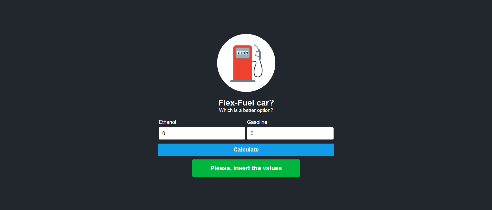
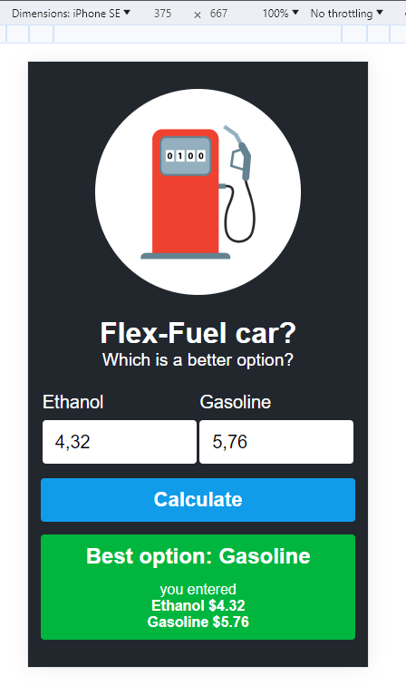

# Best option

## Desktop


## mobile


project created to offer the best fuel prices based on consumer information.

## How use this app
Clone this repository
``` git clone https://github.com/wellpinho/best-offer.git ```
``` cd  best-offer ```
``` npm i ```
``` npm run dev ```

## then access
http://localhost:5173

- Feel free to contribute improvements
1. To contribute to this project, fork this project add your improvements, test, and build with npm run build. Then commit to this repository.

- you can find me on LinkedIn <a href="https://www.linkedin.com/in/wellpinho/">https://www.linkedin.com/in/wellpinho/</a>
